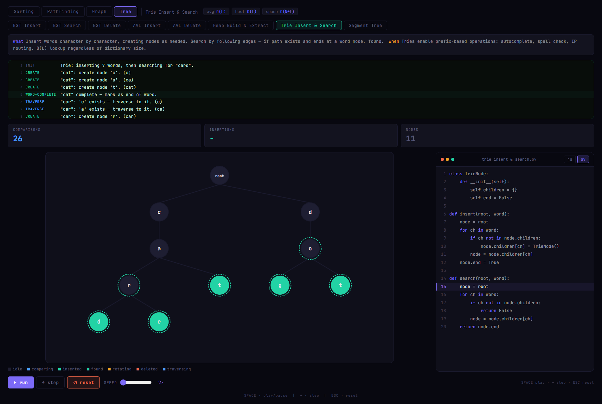

# Algo Visualizer

> An interactive algorithm visualizer that shows how algorithms work internally, step by step.
It combines visual execution with synchronized code to make the logic, flow, and behavior easy to understand.
---


## What is this?

Algo Visualizer is a learning tool for understanding how algorithms actually work — not just memorizing Big O complexity, but seeing _why_ they make the decisions they do at every single step.

Most algorithm visualizers just show bars moving. This one narrates each operation in plain English as it happens, highlights the exact line of code being executed, and lets you step through one operation at a time so you can follow the logic yourself.

Built for:

- Developers preparing for technical interviews who want to _understand_, not memorize
- CS students who learn better by seeing than reading
- Anyone who's ever wondered "wait, how does quicksort actually partition?"

---

## Algorithms

### Sorting — 8 algorithms

| Algorithm      | Category       | Avg        | Best       | Space    |
| -------------- | -------------- | ---------- | ---------- | -------- |
| Bubble Sort    | Comparison     | O(n²)      | O(n)       | O(1)     |
| Selection Sort | Comparison     | O(n²)      | O(n²)      | O(1)     |
| Insertion Sort | Comparison     | O(n²)      | O(n)       | O(1)     |
| Merge Sort     | Comparison     | O(n log n) | O(n log n) | O(n)     |
| Quick Sort     | Comparison     | O(n log n) | O(n log n) | O(log n) |
| Heap Sort      | Comparison     | O(n log n) | O(n log n) | O(1)     |
| Counting Sort  | Non-comparison | O(n+k)     | O(n+k)     | O(k)     |
| Radix Sort     | Non-comparison | O(nk)      | O(nk)      | O(n+k)   |

Every algorithm narrates each comparison, swap, and pass in plain English, with a live code panel that highlights the exact line running — in JavaScript or Python.

### Pathfinding — 6 algorithms

| Algorithm         | Shortest path?   | Weighted? | Notes                                 |
| ----------------- | ---------------- | --------- | ------------------------------------- |
| A\*               | Yes              | Yes       | Best general-purpose — uses heuristic |
| Dijkstra          | Yes              | Yes       | A\* without the heuristic             |
| BFS               | Yes (unweighted) | No        | Guaranteed shortest on uniform grids  |
| DFS               | No               | No        | Explores deep, not optimal            |
| Greedy BFS        | No               | No        | Fast but may miss shorter paths       |
| Bidirectional BFS | Yes              | No        | ~Half the nodes of regular BFS        |

The pathfinding grid is fully interactive — draw walls, place weighted cells (cost ×3), drag start and end markers anywhere, and watch each algorithm carve through the grid differently.

### Graph — 4 algorithms

| Algorithm        | Type             | Complexity  | Notes                                      |
| ---------------- | ---------------- | ----------- | ------------------------------------------ |
| Kruskal's MST    | Minimum spanning | O(E log E)  | Sort edges, greedily add via Union-Find     |
| Prim's MST       | Minimum spanning | O(E log V)  | Grow tree from seed, always cheapest edge   |
| Topological Sort | Ordering         | O(V + E)    | Kahn's algorithm — dependency resolution    |
| Cycle Detection  | Analysis         | O(V + E)    | DFS coloring — white/gray/black back edges  |

SVG-based visualization with animated node and edge coloring. Preset graphs include a DAG, weighted undirected graph, and directed graphs with and without cycles.

### Trees - 5 algorithms

| Algorithm    | Type                 | Complexity                   | Notes                                                        |
| ------------ | -------------------- | ---------------------------- | ------------------------------------------------------------ |
| BST          | Search/Insert/Delete | O(log n) avg / O(n) worst    | Ordered tree; deletion uses inorder successor/predecessor    |
| AVL Tree     | Self-balancing       | O(log n)                     | Rotations maintain strict height balance                     |
| Heap         | Priority Queue       | Build: O(n), Ops: O(log n)   | Max-heap via sift-down; used in schedulers, PQs, heap sort   |
| Trie         | String Indexing      | O(L)                         | Character-wise tree; efficient prefix search, autocomplete   |
| Segment Tree | Range Queries        | Build: O(n), Query: O(log n) | Range aggregation + updates via recursive interval splitting |


---

## Features

**Logger** — Displays each step as you progress, explaining actions in plain English. Supports jumping to any step to review or replay the algorithm flow.

**Live code sync** — The exact line being executed is highlighted in the code panel as the animation plays. Toggle between JavaScript and Python. Step through manually to trace the logic line by line.

**Step mode** — Advance one operation at a time with `→`. Pause mid-algorithm, inspect the state, resume whenever you're ready.

**Heuristic toggle for A\*** — Switch between Manhattan, Euclidean, and Diagonal distance heuristics and see how each changes which cells A\* explores.

**Grid presets** — One-click: Clear, Default walls, Maze, Dense obstacles, Weighted terrain. Graph presets: DAG, Weighted, Directed (cycle), Directed (no cycle).

**"What" and "When"** — Every algorithm has a plain-English description of how it works and a real-world use case for when you'd actually reach for it.

**Keyboard shortcuts**

| Key     | Action             |
| ------- | ------------------ |
| `Space` | Play / Pause       |
| `→`     | Step one operation |
| `Esc`   | Reset              |

---

## Getting started

```bash
git clone https://github.com/nikhilswain/algo-visualizer.git
cd algo-visualizer
npm install
npm run dev
```

No external runtime dependencies beyond React. Uses CSS transitions and native JS timing — no animation library needed.

---

## Project structure

```
src/
├── App.tsx                          # Root layout
├── theme.ts                         # Design tokens (colors, fonts)
├── store/
│   └── index.tsx                    # Global state — useReducer + Context
├── hooks/
│   └── useVisualizer.ts             # Run / step / pause / reset logic
├── algorithms/
│   ├── sorting/index.ts             # All 8 sort generators
│   ├── pathfinding/index.ts         # All 6 path generators
│   └── graph/index.ts               # All 4 graph generators
└── components/
    ├── Bars/                        # Sorting bar chart
    ├── Grid/                        # Pathfinding grid + wall drawing
    ├── Graph/                       # SVG graph visualization + presets
    ├── CodePanel/                   # Syntax-highlighted code + line sync
    ├── Narrator/                    # Plain-English step explanation
    ├── Controls/                    # Run / pause / step / reset + presets
    └── Layout/
        ├── TopBar.tsx               # Category tabs + algo picker + complexity badges
        ├── StatsBar.tsx             # Live stats (comparisons, swaps, visited...)
        └── SortLegend.tsx           # Color legend
```

---

## How algorithms are structured

Every algorithm is a JavaScript generator function that `yield`s step objects. The visualizer consumes these one at a time — which is what makes step mode, pausing, and narration work without any complex async orchestration.

```js
// Example step object (sorting)
{
  type: 'compare',     // compare | swap | sorted | pivot | current | done
  i: 3,               // first index
  j: 5,               // second index
  comps: 12,          // running comparison count
  swaps: 4,           // running swap count
  passes: 2,          // current pass number
  arr: [...],         // full array snapshot at this step
  line: { js: 4, py: 3 }, // line to highlight per language
  msg: 'Comparing [3]=7 vs [5]=2. Out of order → swap.',
}

// Example step object (pathfinding)
{
  type: 'visit',       // visit | frontier | path | done
  r: 5, c: 8,          // grid coordinates
  gCost: 6,            // actual cost from start
  hCost: 4,            // heuristic estimate to goal
  fCost: 10,           // f = g + h
  visited: 42,         // total cells visited so far
  frontier: 18,        // current frontier size
  msg: 'Expanding (5,8) — g=6, h=4, f=10.',
}

// Example step object (graph)
{
  type: 'consider-edge', // visit-node | consider-edge | add-edge | reject-edge | cycle-found | done
  from: 'A',
  to: 'B',
  edgesProcessed: 3,
  mstWeight: 6,
  mstEdges: 2,
  line: { js: 7, py: 7 },
  narrate: 'Considering edge A-B (weight 4). Do A and B belong to different components?',
}
```

Adding a new algorithm means writing one generator function and one config entry. The UI picks it up automatically.

---

## Roadmap

### Phase 1 — More algorithms

**Sorting**

- [ ] TimSort — what Python and V8 actually use; hybrid merge + insertion
- [ ] Shell Sort — gap sequence visualization
- [ ] Cycle Sort — minimizes writes, interesting contrast to Selection

**Pathfinding**

- [ ] Jump Point Search (JPS) — optimized A\* for uniform grids, dramatically fewer expanded nodes
- [ ] Theta* — any-angle pathfinding, smoother paths than grid-constrained A*
- [ ] IDA* — iterative deepening A*, memory-efficient for large grids

**Dynamic programming** _(new category)_

- [ ] Fibonacci — recursive call tree vs memoized table, side by side
- [ ] Longest Common Subsequence — grid fill visualization
- [ ] 0/1 Knapsack — DP table construction step by step

### Phase 2 — Features

- [ ] **Comparison mode** — split screen race, two algorithms on the same input, live stat comparison
- [ ] **Timeline scrubber** — drag a slider to replay any step, rewind, inspect past states
- [ ] **State inspector** — click any cell during pathfinding to see g, h, f, and parent
- [ ] **Debug panel** — toggle to expose internal data structures (open set, closed set, queue, stack) at each step
- [ ] **Custom input** — paste a JSON array for sorting, or upload a grid config for pathfinding
- [ ] **Heatmap overlay** — color-code every cell by its h(n) value during A\* to visualize the heuristic

### Phase 3 — Polish

- [ ] Mobile layout — touch-friendly grid drawing, responsive bar chart
- [ ] Persist settings — remember speed, language, last algorithm used
- [ ] Export — save a replay as a GIF or step-by-step image sequence
- [ ] Plugin API — define your own algorithm generator and load it into the visualizer

---

## Design decisions

**Generators over callbacks** — Every algorithm is a generator function. The runner calls `gen.next()` in a loop. Pause means stop calling. Step means call once. Rewind (future) means replay from a snapshot. No callback hell, no complex effect chains.

**No animation library** — Bar and cell transitions are pure CSS (`transition: background 0.1s, height 0.08s`). Keeps the bundle lean and timing predictable. Anime.js was used in early prototyping but wasn't needed for the final result.

**Narration lives in the algorithm** — Each `yield` carries its own `msg` string. The algorithm itself knows best what it's doing at each step, so the explanation is co-located with the logic rather than mapped from the outside.

**Global state via useReducer** — One reducer, one context. Components dispatch typed actions and read the slice they need. No prop drilling, no Zustand/Redux overhead for a project of this size.

---

## Contributing

The easiest contribution is adding a new algorithm:

1. Write a generator function in `src/algorithms/sorting/index.ts`, `src/algorithms/pathfinding/index.ts`, or `src/algorithms/graph/index.ts`
2. Add a config entry with `label`, `complexity`, `info`, `why`, `code` (JS + Python), and your generator as `fn`
3. The UI picks it up automatically — no other changes needed

For new algorithm categories (tree, DP), add a file under `src/algorithms/`, create a corresponding component in `src/components/`, and wire it into `TopBar.tsx` and `useVisualizer.ts`.

Open an issue before starting a big feature so we can align on approach.

---
